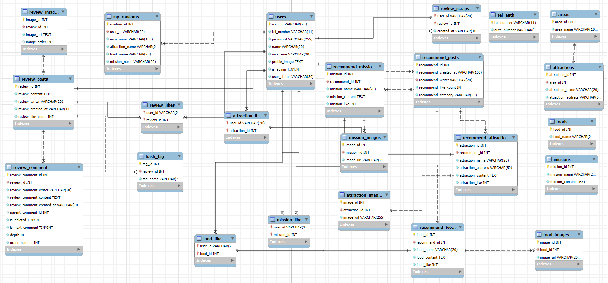

# 1. Project Overview (프로젝트 개요)
- 프로젝트 이름: ANYWHERE
- 프로젝트 설명: 여행지 랜덤 추천 커뮤니티
- 프로젝트 기간: 24.11.25 - 25.01.30

<br/>
<br/>

# 2. Team Members (팀원 및 팀 소개)
| 이병준 | 김세연 | 정승아 | 장채원 |
|:------:|:------:|:------:|:------:|
|  |  |  |
| [GitHub](https://github.com/imwkdrh) | [GitHub](https://github.com/workmakerdaily) |[GitHub](https://github.com/Jeongsunga) | [GitHub](https://github.com/mikieoo) |

<br/>
<br/>

# 3. Key Features (페이지별 주요 기능)
- **Main Page**:
  - 룰렛 클릭! 버튼을 눌려서 지역, 관광지, 음식, 미션을 보여준다.
  - 로그인 하고 룰렛 클릭! 눌렸을 시 기록이 저장된다.

- **Review List**:
  - 게시글은 닉네임, 이미지, 내용, 사용자에 따른 좋아요 상태, 좋아요수, 해시태그, 날짜를 보여준다.
  - 우측 상단 이모티콘으로 게시글을 수정할 수 있는 페이지로 이동할 수 있다.
  - 게시글의 본문을 클릭하면 디테일 모달이 띄워진다.
  - 로그인한 사용자만 좋아요를 누를 수 있는 하트 이모티콘이 보여진다.
  - 게시글은 무한 스크롤 형태로 보여진다.
  - 이미지를 여러 장일 경우 옆으로 슬라이드하면 다른 사진을 볼 수 있다.
  - 게시글에 많이 태그된 해시태그 순으로 인기 키워드를 보여준다.

- **Review Detail**:
  - 게시글은 닉네임, 내용, 해시태그, 대댓글을 보여준다.
  - 게시글 리스트에서 일정 글자수를 초과하면 …으로 표현된 내용의 전체를 볼 수 있다.
  - 대댓글은 댓글의 깊이에 따라 계단 형식으로 보여진다.
  - 댓글이 아닌 대댓글을 쓸 경우 해당 댓글의 댓글 작성 버튼을 누른 후 작성 할 수 있다. (만약 댓글 작성 버튼을 누른 후에 댓글을 쓰고 싶다면 해당 버튼을 재클릭한다.)
  - 본인이 작성한 (대)댓글만 댓글 수정, 댓글 삭제 버튼이 나타난다.
  - 댓글 수정 버튼을 누를 시 댓글 내용을 입력창에 가져오고 수정 후 입력 버튼을 클릭하면 (대)댓글이 수정된다.
  - 댓글 삭제 버튼은 사용자에게 삭제 여부를 물은 후 (대)댓글을 삭제한다.
  - 댓글 작성/수정/삭제 후 새로고침 하지 않고 바로 적용되게 한다.

- **Review Write/Update&Delete**:
  - 게시글은 이미지, 내용, 해시태그를 입력 및 수정 받는다.
  - 이미지는 무조건 입력 받는 필수 값이며, 여러 장 가능하다.
  - 해시태그를 할 내용을 입력 후 엔터 키를 누르면 자동으로 #이 붙인 채로 등록된다.
  - 등록된 해시태그를 클릭하면 해시태그를 삭제할 수 있다.
  - 삭제 버튼은 사용자에게 삭제 여부를 물은 후 게시글을 삭제한다.


- **Recommend List**:
  - 게시글의 리스트에는 작성자의 닉네임과 작성한 날짜, 좋아요 버튼, 사용자가 추천한 카테고리들의 사진들이 슬라이드 형식으로 보여진다.
  - 게시글은 무한 스크롤 형태로 보여진다.
  - 이미지 또는 글이 여러 개일 경우에는 슬라이드하면 글과 사진을 볼 수 있다.
  - 로그인한 사용자에게만 좋아요 버튼이 보인다. 
  - 게시글 리스트에서 게시글의 내용이 너무 길어지면 일부만 표시되며 밑줄임(...)으로 표시된다.
  - 밑줄임 표시 위에  커서를 올리면 자그마한 모달창으로 전체 내용이 표시된다.
  - 추천 게시판의 배너에서 관광지, 먹거리, 미션 중에 보고 싶은 카테고리를 선택하면 그 게시판으로 이동한다.

- **Recommend Write**:
  - 게시글은 추천 카테고리, 제목, 내용, 사진은 필수 값이다.
  - 사용자는 한 게시글에서 한 카테고리만 추천할 수 있다.
  - 사용자는 더 추가하고 싶은 추천이 있다면 플러스 버튼을 눌러 추가할 수 있다.
  - 이미지를 추가하고 싶다면 이미지 추가 버튼을 클릭하여 추가할 수 있다.
  - 취소 버튼을 누르면 게시글 리스트 화면으로 돌아간다.

- **Recommend Update**:
  - 수정은 각각 수정 버튼을 클릭하여 수정이 가능하다.
  - 각자 수정 후에 무조건 저장 버튼을 눌러야 수정이 된다.
  - 이미지를 삭제 하고 싶다면 이미지의 x 버튼을 눌러 삭제하고 삭제하는 즉시 바로 삭제 된다.
  - 사용자가 수정 할때 추천을 더 추가하고 싶다면 플러스 버튼을 눌러 추가할 수 있고 마지막에 밑에 있는 수정 버튼을 클릭해야 추가한 추천이 반영된다.
  - 취소 버튼을 누르면 게시글 리스트 화면으로 나가진다.

- **HashTagBar**:
  - 사용자들이 게시글에서 사용한 해시태그의 수를 계산하여 사용자들의 제일 많이 사용한 상위 5개의 해시태그를 바를 통해 보여준다.

- **MyPage**:
  - 마이페이지에서 해당 사용자의 정보를 가져온다. (닉네임, 작성한 글, 돌린 룰렛 기록)
  - 버튼 상태:
    - 사용자의 계정이 관리자 계정일 경우 룰렛의 추가 및 삭제가 가능한 버튼이 보여지게된다.
    - 카테고리 버튼을 사용하여 사용자가 작성한 글들의 갤러리와 돌린 룰렛기록을 볼 수 있다.
  - 게시글 갤러리:
    - 사용자가 작성한 후기 게시글, 추천 게시글 목록을 제공하며, 후기 게시글 사진을 클릭 시 해당 글의 상세 정보가 모달창으로 뜬다.
    - 갤러리에 마우스를 가져다 대면 수정,삭제 버튼이 보여지게 되고, 수정 클릭 시 수정 페이지로 이동, 삭제 클릭 시에 삭제를 할지 창이 뜨게 된다.
  - 룰렛 기록
    - 메인 화면에서 저장된 룰렛 기록을 조회, 삭제 가능하다.
    - 현재 마이페이지의 사용자의 기록만을 보여준다.
  - 디자인 및 배치:
    - 프로필 이미지, 닉네임은 좌측 상단에, 우측에는 후기,추천 게시판, 룰렛 기록 갯수가 표시된다.
    - 닉네임 우측의 설정 버튼을 통해 개인정보 수정 페이지로 이동할 수 있다.

- **유저 정보 변경**:
  - 사용자의 프로필 이미지, 이름, 닉네임, 비밀번호, 전화번호를 수정할 수 있다.
  - 전화번호 수정 시 인증번호를 이용해 인증을 거쳐야만 전화번호 수정을 할 수 있다.
  - 비밀번호 수정 시, 현재 비밀번호와 수정할 비밀번호를 입력하고 인증을 거쳐야만 비밀번호를 안전하게 수정할 수 있다.


<br/>
<br/>

# 4. Tasks & Responsibilities (작업 및 역할 분담)

## front-end

|  |  |  |
|-----------------|-----------------|-----------------|
| 이병준    |   | <ul><li>그리드형 갤러리, 필터링</li><li>마이페이지</li><li>회원정보 수정 페이지</li><li>사용자의 작성글 갯수 및 글 가져오기</li><li>각 게시판의 갤러리 불러오기</li></ul>     |
| 김세연   |  | <ul><li>네비게이션 바</li><li>메인화면</li><li>룰렛</li><li>왼쪽 사이드 바</li><li>추천 게시판 배너</li><li>관리자 페이지 및 룰렛 추가 및 삭제</li><li>마이페이지 코멘트 수정</li></ul> |
| 정승아    |      | <ul><li>리뷰 게시판 작성, 수정, 삭제</li><li>전체 리스트 보기</li><li>상세보기 페이지</li><li>리뷰 대댓글 조회, 작성, 수정, 삭제</li></ul>    |
| 장채원    |      | <ul><li>회원가입 화면</li><li>로그인 화면</li><li>추천 게시판 사진 슬라이드 기능</li><li>마이페이지 랜덤 내역 조회</li></ul>    |

## back-end

|  |  |  |
|-----------------|-----------------|-----------------|
| 이병준    |   | <ul><li>후기 게시판 초기 CRUD</li><li>로그인</li><li>사용자 정보 열람 및 수정</li> | 
| 김세연   |  | <ul><li>메인화면 지역, 관광지, 먹거리, 미션 룰렛 가져오기 |
| 정승아    |      | <ul><li>리뷰 게시판 CRUD</li><li>리뷰 대댓글 CRUD</ul>    |
| 장채원    |      | <ul><li>회원가입 기능</li><li>추천 게시판 CRUD</li><li>추천 게시판 좋아요 </li><li>후기 게시판 좋아요</li><li>해시태그 등록, 삭제, 조회</li><li>나의 룰렛 기록 조회, 등록, 삭제</li></ul>    |
</ul>     


<br/>
<br/>

# 5. Technology Stack (기술 스택)
## 5.1 Database
|  |  |
|-----------------|-----------------|
| MySQL   || 


<br/>

## 5.2 Frot-end
|  |  |  |
|-----------------|-----------------|:-----------------:|
| React    |   | 18.3.11    |
| Typescript    |  | 4.9.5   |
| MaterialUI    |      | 6.1.6  |
| HTML    |      |     |
| CSS    |      |     |

<br/>

## 5.3 Back-end
|  |  |  |
|-----------------|-----------------|-----------------|
| Spring boot    |      | 3.3.4    |
| Gradle    |      | 8.8    |
| Java    |      | 17.0.12    |

<br/>

## 5.4 Develope Tool
|  |  |
|-----------------|-----------------|
| Window10, 11    |      |
| vscode    |      |
| MySQL Workbrench    |      |
| Figma    |      |

## 5.5 Cooperation tool
|  |  |
|-----------------|-----------------|
| Notion    |      |
| Git    |      |

## 5.6 개발언어 및 프레임워크
- Spring Security
- Jwt
- Lombok

## 5.7 API
- JPA


<br/>

# 6. Project Structure (프로젝트 구조)
### front-end
```plaintext
📦src
 ┣ 📂apis
 ┃ ┣ 📂dto
 ┃ ┃ ┣ 📂request
 ┃ ┃ ┃ ┣ 📂auth
 ┃ ┃ ┃ ┃ ┣ 📜id-check.request.dto.ts
 ┃ ┃ ┃ ┃ ┣ 📜index.ts
 ┃ ┃ ┃ ┃ ┣ 📜sign-in.request.dto.ts
 ┃ ┃ ┃ ┃ ┣ 📜sign-up.request.dto.ts
 ┃ ┃ ┃ ┃ ┣ 📜tel-auth-check.request.dto.ts
 ┃ ┃ ┃ ┃ ┗ 📜tel-auth.request.dto.ts
 ┃ ┃ ┃ ┣ 📂hashtag
 ┃ ┃ ┃ ┃ ┣ 📜index.ts
 ┃ ┃ ┃ ┃ ┗ 📜post-hash-tag.request.dto.ts
 ┃ ┃ ┃ ┣ 📂recommend
 ┃ ┃ ┃ ┃ ┣ 📜index.ts
 ┃ ┃ ┃ ┃ ┣ 📜patch-recommend-attraction.request.dto.ts
 ┃ ┃ ┃ ┃ ┣ 📜patch-recommend-food.request.dto.ts
 ┃ ┃ ┃ ┃ ┣ 📜patch-recommend-image.request.dto.ts
 ┃ ┃ ┃ ┃ ┣ 📜patch-recommend-mission.request.dto.ts
 ┃ ┃ ┃ ┃ ┣ 📜patch-recommend-post.request.dto.ts
 ┃ ┃ ┃ ┃ ┣ 📜post-attraction-image.request.dto.ts
 ┃ ┃ ┃ ┃ ┣ 📜post-food-image.request.dto.ts
 ┃ ┃ ┃ ┃ ┣ 📜post-mission-image.request.dto.ts
 ┃ ┃ ┃ ┃ ┣ 📜post-recommend-attraction.request.dto.ts
 ┃ ┃ ┃ ┃ ┣ 📜post-recommend-food.request.dto.ts
 ┃ ┃ ┃ ┃ ┣ 📜post-recommend-image.request.dto.ts
 ┃ ┃ ┃ ┃ ┣ 📜post-recommend-mission.request.dto.ts
 ┃ ┃ ┃ ┃ ┗ 📜post-recommend-post.request.dto.ts
 ┃ ┃ ┃ ┣ 📂review
 ┃ ┃ ┃ ┃ ┣ 📜index.ts
 ┃ ┃ ┃ ┃ ┣ 📜patch-review-comment.request.dto.ts
 ┃ ┃ ┃ ┃ ┣ 📜patch-review-post.request.dto.ts
 ┃ ┃ ┃ ┃ ┣ 📜post-review-comment.request.dto.ts
 ┃ ┃ ┃ ┃ ┗ 📜post-review-post.request.dto.ts
 ┃ ┃ ┃ ┣ 📂roulette
 ┃ ┃ ┃ ┃ ┣ 📜index.ts
 ┃ ┃ ┃ ┃ ┣ 📜post-area.request.dto.ts
 ┃ ┃ ┃ ┃ ┣ 📜post-attraction.dto.ts
 ┃ ┃ ┃ ┃ ┣ 📜post-food.request.dto.ts
 ┃ ┃ ┃ ┃ ┣ 📜post-mission.request.dto.ts
 ┃ ┃ ┃ ┃ ┗ 📜post-roulette.request.dto.ts
 ┃ ┃ ┃ ┣ 📂user
 ┃ ┃ ┃ ┃ ┣ 📜index.ts
 ┃ ┃ ┃ ┃ ┣ 📜patch-password.request.dto.ts
 ┃ ┃ ┃ ┃ ┣ 📜patch-tel-auth-check.request.dto.ts
 ┃ ┃ ┃ ┃ ┣ 📜patch-tel-auth.request.dto.ts
 ┃ ┃ ┃ ┃ ┗ 📜patch-user.request.dto.ts
 ┃ ┃ ┃ ┗ 📜index.ts
 ┃ ┃ ┗ 📂response
 ┃ ┃ ┃ ┣ 📂area
 ┃ ┃ ┃ ┃ ┣ 📜get-area.response.dto.ts
 ┃ ┃ ┃ ┃ ┗ 📜index.ts
 ┃ ┃ ┃ ┣ 📂attraction
 ┃ ┃ ┃ ┃ ┣ 📜get-attraction.response.dto.ts
 ┃ ┃ ┃ ┃ ┗ 📜index.ts
 ┃ ┃ ┃ ┣ 📂auth
 ┃ ┃ ┃ ┃ ┣ 📜get-sign-in.response.dto.ts
 ┃ ┃ ┃ ┃ ┣ 📜index.ts
 ┃ ┃ ┃ ┃ ┗ 📜sign-in.response.dto.ts
 ┃ ┃ ┃ ┣ 📂food
 ┃ ┃ ┃ ┃ ┣ 📜get-food.response.dto.ts
 ┃ ┃ ┃ ┃ ┗ 📜index.ts
 ┃ ┃ ┃ ┣ 📂hashtag
 ┃ ┃ ┃ ┃ ┣ 📜get-hash-tag-list.response.dto.ts
 ┃ ┃ ┃ ┃ ┗ 📜index.ts
 ┃ ┃ ┃ ┣ 📂mission
 ┃ ┃ ┃ ┃ ┣ 📜get-mission.response.dto.ts
 ┃ ┃ ┃ ┃ ┗ 📜index.ts
 ┃ ┃ ┃ ┣ 📂recommend
 ┃ ┃ ┃ ┃ ┣ 📜get-recommend-attraction-list.response.dto.ts
 ┃ ┃ ┃ ┃ ┣ 📜get-recommend-attraction-post.response.dto.ts
 ┃ ┃ ┃ ┃ ┣ 📜get-recommend-food-list.response.dto.ts
 ┃ ┃ ┃ ┃ ┣ 📜get-recommend-food-post.response.dto.ts
 ┃ ┃ ┃ ┃ ┣ 📜get-recommend-mission-list.response.dto.ts
 ┃ ┃ ┃ ┃ ┣ 📜get-recommend-mission-post.response.dto.ts
 ┃ ┃ ┃ ┃ ┣ 📜get-recommend-post-list.response.dto.ts
 ┃ ┃ ┃ ┃ ┣ 📜get-recommend-post.response.dto.ts
 ┃ ┃ ┃ ┃ ┗ 📜index.ts
 ┃ ┃ ┃ ┣ 📂review
 ┃ ┃ ┃ ┃ ┣ 📜get-review-comment-list.response.dto.ts
 ┃ ┃ ┃ ┃ ┣ 📜get-review-comment.dto.ts
 ┃ ┃ ┃ ┃ ┣ 📜get-review-list.response.dto.ts
 ┃ ┃ ┃ ┃ ┣ 📜get-review.response.dto.ts
 ┃ ┃ ┃ ┃ ┗ 📜index.ts
 ┃ ┃ ┃ ┣ 📂roulette
 ┃ ┃ ┃ ┃ ┣ 📜get-roulette-list.response.dto.ts
 ┃ ┃ ┃ ┃ ┗ 📜index.ts
 ┃ ┃ ┃ ┣ 📂user
 ┃ ┃ ┃ ┃ ┗ 📜get-user-info.response.dto.ts
 ┃ ┃ ┃ ┣ 📜index.ts
 ┃ ┃ ┃ ┗ 📜response.dto.ts
 ┃ ┗ 📜index.ts
 ┣ 📂components
 ┃ ┣ 📂InputBox
 ┃ ┃ ┣ 📜index.tsx
 ┃ ┃ ┗ 📜style.css
 ┃ ┣ 📂pagination
 ┃ ┃ ┣ 📜index.tsx
 ┃ ┃ ┗ 📜style.css
 ┃ ┣ 📂signup
 ┃ ┃ ┣ 📜index.tsx
 ┃ ┃ ┗ 📜style.css
 ┃ ┗ 📂updateuser
 ┃ ┃ ┣ 📜index.tsx
 ┃ ┃ ┗ 📜style.css
 ┣ 📂constants
 ┃ ┗ 📜index.ts
 ┣ 📂hooks
 ┃ ┣ 📜index.ts
 ┃ ┗ 📜review.pagination.hook.ts
 ┣ 📂layouts
 ┃ ┗ 📂MainLayout
 ┃ ┃ ┣ 📜index.tsx
 ┃ ┃ ┗ 📜style.css
 ┣ 📂stores
 ┃ ┣ 📜index.ts
 ┃ ┗ 📜sign-in-user.store.ts
 ┣ 📂types
 ┃ ┣ 📜area-get.interface.ts
 ┃ ┣ 📜attraction-get.interface.ts
 ┃ ┣ 📜attraction-image.interface.ts
 ┃ ┣ 📜food-get.interface.ts
 ┃ ┣ 📜food-image.interface.ts
 ┃ ┣ 📜hash-tag.interface.ts
 ┃ ┣ 📜index.ts
 ┃ ┣ 📜mission-get.interface.ts
 ┃ ┣ 📜mission-image.interface.ts
 ┃ ┣ 📜my-random.interface.ts
 ┃ ┣ 📜recommend-attraction.interface.ts
 ┃ ┣ 📜recommend-food.interface.ts
 ┃ ┣ 📜recommend-mission.interface.ts
 ┃ ┣ 📜recommend-post.interface.ts
 ┃ ┣ 📜review-comment-children.interface.ts
 ┃ ┣ 📜review-comment.interface.ts
 ┃ ┣ 📜review-image.interface.ts
 ┃ ┣ 📜review-post.interface.ts
 ┃ ┗ 📜sign-in-user.interface.ts
 ┣ 📂utils
 ┃ ┗ 📜index.ts
 ┣ 📂views
 ┃ ┣ 📂Auth
 ┃ ┃ ┣ 📜index.tsx
 ┃ ┃ ┗ 📜style.css
 ┃ ┣ 📂Banner
 ┃ ┃ ┣ 📜index.tsx
 ┃ ┃ ┗ 📜style.css
 ┃ ┣ 📂HashTagBar
 ┃ ┃ ┣ 📜index.tsx
 ┃ ┃ ┗ 📜style.css
 ┃ ┣ 📂Main
 ┃ ┃ ┣ 📜index.tsx
 ┃ ┃ ┗ 📜style.css
 ┃ ┣ 📂Mypage
 ┃ ┃ ┣ 📂Update
 ┃ ┃ ┃ ┣ 📜index.tsx
 ┃ ┃ ┃ ┗ 📜style.css
 ┃ ┃ ┣ 📜index.tsx
 ┃ ┃ ┗ 📜style.css
 ┃ ┣ 📂NavigationBar
 ┃ ┃ ┣ 📜index.tsx
 ┃ ┃ ┗ 📜style.css
 ┃ ┣ 📂Recommend
 ┃ ┃ ┣ 📂Update
 ┃ ┃ ┃ ┣ 📜index.tsx
 ┃ ┃ ┃ ┗ 📜style.css
 ┃ ┃ ┣ 📂Write
 ┃ ┃ ┃ ┣ 📜index.tsx
 ┃ ┃ ┃ ┗ 📜style.css
 ┃ ┃ ┣ 📜index.tsx
 ┃ ┃ ┗ 📜style.css
 ┃ ┣ 📂Review
 ┃ ┃ ┣ 📂Update
 ┃ ┃ ┃ ┣ 📜index.tsx
 ┃ ┃ ┃ ┗ 📜style.css
 ┃ ┃ ┣ 📂Write
 ┃ ┃ ┃ ┣ 📜index.tsx
 ┃ ┃ ┃ ┗ 📜style.css
 ┃ ┃ ┣ 📜index.tsx
 ┃ ┃ ┗ 📜style.css
 ┃ ┣ 📂RouletteAdd
 ┃ ┃ ┣ 📜index.tsx
 ┃ ┃ ┗ 📜style.css
 ┃ ┣ 📂RouletteDel
 ┃ ┃ ┣ 📜index.tsx
 ┃ ┃ ┗ 📜style.css
 ┃ ┣ 📂ScrollTopButton
 ┃ ┃ ┣ 📜index.tsx
 ┃ ┃ ┗ 📜style.css
 ┃ ┗ 📂SideBar
 ┃ ┃ ┣ 📜index.tsx
 ┃ ┃ ┗ 📜style.css
 ┣ 📜Anywhere.css
 ┣ 📜Anywhere.tsx
 ┣ 📜index.css
 ┣ 📜index.tsx
 ┗ 📜react-app-env.d.ts
```

### back-end
```plaintext
📦src
 ┗ 📂main
 ┃ ┣ 📂java
 ┃ ┃ ┗ 📂com
 ┃ ┃ ┃ ┗ 📂project
 ┃ ┃ ┃ ┃ ┗ 📂anywhere
 ┃ ┃ ┃ ┃ ┃ ┣ 📂common
 ┃ ┃ ┃ ┃ ┃ ┃ ┣ 📂object
 ┃ ┃ ┃ ┃ ┃ ┃ ┃ ┣ 📜Areas.java
 ┃ ┃ ┃ ┃ ┃ ┃ ┃ ┣ 📜Attractions.java
 ┃ ┃ ┃ ┃ ┃ ┃ ┃ ┣ 📜Foods.java
 ┃ ┃ ┃ ┃ ┃ ┃ ┃ ┣ 📜HashTag.java
 ┃ ┃ ┃ ┃ ┃ ┃ ┃ ┣ 📜Missions.java
 ┃ ┃ ┃ ┃ ┃ ┃ ┃ ┣ 📜MyRandom.java
 ┃ ┃ ┃ ┃ ┃ ┃ ┃ ┣ 📜RecommendAttraction.java
 ┃ ┃ ┃ ┃ ┃ ┃ ┃ ┣ 📜RecommendFood.java
 ┃ ┃ ┃ ┃ ┃ ┃ ┃ ┣ 📜RecommendMission.java
 ┃ ┃ ┃ ┃ ┃ ┃ ┃ ┣ 📜RecommendPost.java
 ┃ ┃ ┃ ┃ ┃ ┃ ┃ ┣ 📜ReviewComment.java
 ┃ ┃ ┃ ┃ ┃ ┃ ┃ ┣ 📜ReviewImage.java
 ┃ ┃ ┃ ┃ ┃ ┃ ┃ ┣ 📜ReviewPost.java
 ┃ ┃ ┃ ┃ ┃ ┃ ┃ ┗ 📜Users.java
 ┃ ┃ ┃ ┃ ┃ ┃ ┗ 📂util
 ┃ ┃ ┃ ┃ ┃ ┃ ┃ ┗ 📜CreateNumber.java
 ┃ ┃ ┃ ┃ ┃ ┣ 📂config
 ┃ ┃ ┃ ┃ ┃ ┃ ┗ 📜WebSecurityConfig.java
 ┃ ┃ ┃ ┃ ┃ ┣ 📂controller
 ┃ ┃ ┃ ┃ ┃ ┃ ┣ 📜AreaController.java
 ┃ ┃ ┃ ┃ ┃ ┃ ┣ 📜AttractionController.java
 ┃ ┃ ┃ ┃ ┃ ┃ ┣ 📜AuthController.java
 ┃ ┃ ┃ ┃ ┃ ┃ ┣ 📜FileController.java
 ┃ ┃ ┃ ┃ ┃ ┃ ┣ 📜FoodController.java
 ┃ ┃ ┃ ┃ ┃ ┃ ┣ 📜MissionController.java
 ┃ ┃ ┃ ┃ ┃ ┃ ┣ 📜RecommendController.java
 ┃ ┃ ┃ ┃ ┃ ┃ ┣ 📜ReviewController.java
 ┃ ┃ ┃ ┃ ┃ ┃ ┣ 📜RouletteController.java
 ┃ ┃ ┃ ┃ ┃ ┃ ┗ 📜UsersController.java
 ┃ ┃ ┃ ┃ ┃ ┣ 📂dto
 ┃ ┃ ┃ ┃ ┃ ┃ ┣ 📂request
 ┃ ┃ ┃ ┃ ┃ ┃ ┃ ┣ 📂auth
 ┃ ┃ ┃ ┃ ┃ ┃ ┃ ┃ ┣ 📜IdCheckRequestDto.java
 ┃ ┃ ┃ ┃ ┃ ┃ ┃ ┃ ┣ 📜SignInRequestDto.java
 ┃ ┃ ┃ ┃ ┃ ┃ ┃ ┃ ┣ 📜SignUpRequestDto.java
 ┃ ┃ ┃ ┃ ┃ ┃ ┃ ┃ ┣ 📜TelAuthCheckRequestDto.java
 ┃ ┃ ┃ ┃ ┃ ┃ ┃ ┃ ┗ 📜TelAuthRequestDto.java
 ┃ ┃ ┃ ┃ ┃ ┃ ┃ ┣ 📂hashtag
 ┃ ┃ ┃ ┃ ┃ ┃ ┃ ┃ ┗ 📜PostHashTagRequestDto.java
 ┃ ┃ ┃ ┃ ┃ ┃ ┃ ┣ 📂recommend
 ┃ ┃ ┃ ┃ ┃ ┃ ┃ ┃ ┣ 📜PatchRecommendAttractionRequestDto.java
 ┃ ┃ ┃ ┃ ┃ ┃ ┃ ┃ ┣ 📜PatchRecommendFoodRequestDto.java
 ┃ ┃ ┃ ┃ ┃ ┃ ┃ ┃ ┣ 📜PatchRecommendImageRequestDto.java
 ┃ ┃ ┃ ┃ ┃ ┃ ┃ ┃ ┣ 📜PatchRecommendMissionRequestDto.java
 ┃ ┃ ┃ ┃ ┃ ┃ ┃ ┃ ┣ 📜PatchRecommendPostRequestDto.java
 ┃ ┃ ┃ ┃ ┃ ┃ ┃ ┃ ┣ 📜PostAttractionImageRequestDto.java
 ┃ ┃ ┃ ┃ ┃ ┃ ┃ ┃ ┣ 📜PostFoodImageRequestDto.java
 ┃ ┃ ┃ ┃ ┃ ┃ ┃ ┃ ┣ 📜PostMissionImageRequestDto.java
 ┃ ┃ ┃ ┃ ┃ ┃ ┃ ┃ ┣ 📜PostRecommendAttractionRequestDto.java
 ┃ ┃ ┃ ┃ ┃ ┃ ┃ ┃ ┣ 📜PostRecommendFoodRequestDto.java
 ┃ ┃ ┃ ┃ ┃ ┃ ┃ ┃ ┣ 📜PostRecommendImageRequestDto.java
 ┃ ┃ ┃ ┃ ┃ ┃ ┃ ┃ ┣ 📜PostRecommendMissionRequestDto.java
 ┃ ┃ ┃ ┃ ┃ ┃ ┃ ┃ ┗ 📜PostRecommendPostRequestDto.java
 ┃ ┃ ┃ ┃ ┃ ┃ ┃ ┣ 📂review
 ┃ ┃ ┃ ┃ ┃ ┃ ┃ ┃ ┣ 📜PatchReviewCommentRequestDto.java
 ┃ ┃ ┃ ┃ ┃ ┃ ┃ ┃ ┣ 📜PatchReviewRequestDto.java
 ┃ ┃ ┃ ┃ ┃ ┃ ┃ ┃ ┣ 📜PostReviewCommentRequestDto.java
 ┃ ┃ ┃ ┃ ┃ ┃ ┃ ┃ ┣ 📜PostReviewImagesRequestDto.java
 ┃ ┃ ┃ ┃ ┃ ┃ ┃ ┃ ┗ 📜PostReviewRequestDto.java
 ┃ ┃ ┃ ┃ ┃ ┃ ┃ ┣ 📂roulette
 ┃ ┃ ┃ ┃ ┃ ┃ ┃ ┃ ┣ 📜PostAreaRequestDto.java
 ┃ ┃ ┃ ┃ ┃ ┃ ┃ ┃ ┣ 📜PostAttractionRequestDto.java
 ┃ ┃ ┃ ┃ ┃ ┃ ┃ ┃ ┣ 📜PostFoodRequestDto.java
 ┃ ┃ ┃ ┃ ┃ ┃ ┃ ┃ ┣ 📜PostMissionRequestDto.java
 ┃ ┃ ┃ ┃ ┃ ┃ ┃ ┃ ┗ 📜PostRouletteRequestDto.java
 ┃ ┃ ┃ ┃ ┃ ┃ ┃ ┗ 📂users
 ┃ ┃ ┃ ┃ ┃ ┃ ┃ ┃ ┣ 📜PatchPasswordRequestDto.java
 ┃ ┃ ┃ ┃ ┃ ┃ ┃ ┃ ┣ 📜PatchTelAuthRequestDto.java
 ┃ ┃ ┃ ┃ ┃ ┃ ┃ ┃ ┗ 📜PatchUsersRequestDto.java
 ┃ ┃ ┃ ┃ ┃ ┃ ┗ 📂response
 ┃ ┃ ┃ ┃ ┃ ┃ ┃ ┣ 📂area
 ┃ ┃ ┃ ┃ ┃ ┃ ┃ ┃ ┗ 📜GetAreaResponseDto.java
 ┃ ┃ ┃ ┃ ┃ ┃ ┃ ┣ 📂attraction
 ┃ ┃ ┃ ┃ ┃ ┃ ┃ ┃ ┗ 📜GetAttractionResponseDto.java
 ┃ ┃ ┃ ┃ ┃ ┃ ┃ ┣ 📂auth
 ┃ ┃ ┃ ┃ ┃ ┃ ┃ ┃ ┗ 📜SignInResponseDto.java
 ┃ ┃ ┃ ┃ ┃ ┃ ┃ ┣ 📂food
 ┃ ┃ ┃ ┃ ┃ ┃ ┃ ┃ ┗ 📜GetFoodResponseDto.java
 ┃ ┃ ┃ ┃ ┃ ┃ ┃ ┣ 📂hashtag
 ┃ ┃ ┃ ┃ ┃ ┃ ┃ ┃ ┗ 📜GetHashTagListResponseDto.java
 ┃ ┃ ┃ ┃ ┃ ┃ ┃ ┣ 📂mission
 ┃ ┃ ┃ ┃ ┃ ┃ ┃ ┃ ┗ 📜GetMissionResponseDto.java
 ┃ ┃ ┃ ┃ ┃ ┃ ┃ ┣ 📂recommend
 ┃ ┃ ┃ ┃ ┃ ┃ ┃ ┃ ┣ 📜GetRecommendAttractionListResponseDto.java
 ┃ ┃ ┃ ┃ ┃ ┃ ┃ ┃ ┣ 📜GetRecommendAttractionPostResponseDto.java
 ┃ ┃ ┃ ┃ ┃ ┃ ┃ ┃ ┣ 📜GetRecommendFoodListResponseDto.java
 ┃ ┃ ┃ ┃ ┃ ┃ ┃ ┃ ┣ 📜GetRecommendFoodPostResponseDto.java
 ┃ ┃ ┃ ┃ ┃ ┃ ┃ ┃ ┣ 📜GetRecommendMissionListResponseDto.java
 ┃ ┃ ┃ ┃ ┃ ┃ ┃ ┃ ┣ 📜GetRecommendMissionPostResponseDto.java
 ┃ ┃ ┃ ┃ ┃ ┃ ┃ ┃ ┣ 📜GetRecommendPostListResponseDto.java
 ┃ ┃ ┃ ┃ ┃ ┃ ┃ ┃ ┗ 📜GetRecommendPostResponseDto.java
 ┃ ┃ ┃ ┃ ┃ ┃ ┃ ┣ 📂review
 ┃ ┃ ┃ ┃ ┃ ┃ ┃ ┃ ┣ 📜GetReviewCommentListResponseDto.java
 ┃ ┃ ┃ ┃ ┃ ┃ ┃ ┃ ┣ 📜GetReviewCommentResponseDto.java
 ┃ ┃ ┃ ┃ ┃ ┃ ┃ ┃ ┣ 📜GetReviewListResponseDto.java
 ┃ ┃ ┃ ┃ ┃ ┃ ┃ ┃ ┗ 📜GetReviewResponseDto.java
 ┃ ┃ ┃ ┃ ┃ ┃ ┃ ┣ 📂roulette
 ┃ ┃ ┃ ┃ ┃ ┃ ┃ ┃ ┗ 📜GetRouletteListResponseDto.java
 ┃ ┃ ┃ ┃ ┃ ┃ ┃ ┣ 📂users
 ┃ ┃ ┃ ┃ ┃ ┃ ┃ ┃ ┣ 📜GetUserInfoResponseDto.java
 ┃ ┃ ┃ ┃ ┃ ┃ ┃ ┃ ┗ 📜GetUsersResponseDto.java
 ┃ ┃ ┃ ┃ ┃ ┃ ┃ ┣ 📜ResponseCode.java
 ┃ ┃ ┃ ┃ ┃ ┃ ┃ ┣ 📜ResponseDto.java
 ┃ ┃ ┃ ┃ ┃ ┃ ┃ ┗ 📜ResponseMessage.java
 ┃ ┃ ┃ ┃ ┃ ┣ 📂entity
 ┃ ┃ ┃ ┃ ┃ ┃ ┣ 📂pk
 ┃ ┃ ┃ ┃ ┃ ┃ ┃ ┣ 📜AttractionLikePk.java
 ┃ ┃ ┃ ┃ ┃ ┃ ┃ ┣ 📜FoodLikePk.java
 ┃ ┃ ┃ ┃ ┃ ┃ ┃ ┣ 📜MissionLikePk.java
 ┃ ┃ ┃ ┃ ┃ ┃ ┃ ┣ 📜ReviewLikePk.java
 ┃ ┃ ┃ ┃ ┃ ┃ ┃ ┗ 📜ReviewScrapPk.java
 ┃ ┃ ┃ ┃ ┃ ┃ ┣ 📜AreasEntity.java
 ┃ ┃ ┃ ┃ ┃ ┃ ┣ 📜AttractionImageEntity.java
 ┃ ┃ ┃ ┃ ┃ ┃ ┣ 📜AttractionLikeEntity.java
 ┃ ┃ ┃ ┃ ┃ ┃ ┣ 📜AttractionsEntity.java
 ┃ ┃ ┃ ┃ ┃ ┃ ┣ 📜FoodEntity.java
 ┃ ┃ ┃ ┃ ┃ ┃ ┣ 📜FoodImageEntity.java
 ┃ ┃ ┃ ┃ ┃ ┃ ┣ 📜FoodLikeEntity.java
 ┃ ┃ ┃ ┃ ┃ ┃ ┣ 📜HashTagEntity.java
 ┃ ┃ ┃ ┃ ┃ ┃ ┣ 📜MissionImageEntity.java
 ┃ ┃ ┃ ┃ ┃ ┃ ┣ 📜MissionLikeEntity.java
 ┃ ┃ ┃ ┃ ┃ ┃ ┣ 📜MissionsEntity.java
 ┃ ┃ ┃ ┃ ┃ ┃ ┣ 📜MyRandomEntity.java
 ┃ ┃ ┃ ┃ ┃ ┃ ┣ 📜RecommendAttractionEntity.java
 ┃ ┃ ┃ ┃ ┃ ┃ ┣ 📜RecommendFoodEntity.java
 ┃ ┃ ┃ ┃ ┃ ┃ ┣ 📜RecommendMissionEntity.java
 ┃ ┃ ┃ ┃ ┃ ┃ ┣ 📜RecommendPostEntity.java
 ┃ ┃ ┃ ┃ ┃ ┃ ┣ 📜ReviewCommentEntity.java
 ┃ ┃ ┃ ┃ ┃ ┃ ┣ 📜ReviewImagesEntity.java
 ┃ ┃ ┃ ┃ ┃ ┃ ┣ 📜ReviewLikeEntity.java
 ┃ ┃ ┃ ┃ ┃ ┃ ┣ 📜ReviewPostEntity.java
 ┃ ┃ ┃ ┃ ┃ ┃ ┣ 📜ReviewScrapEntity.java
 ┃ ┃ ┃ ┃ ┃ ┃ ┣ 📜TelAuthEntity.java
 ┃ ┃ ┃ ┃ ┃ ┃ ┗ 📜UsersEntity.java
 ┃ ┃ ┃ ┃ ┃ ┣ 📂filter
 ┃ ┃ ┃ ┃ ┃ ┃ ┗ 📜JwtAuthenticationFilter.java
 ┃ ┃ ┃ ┃ ┃ ┣ 📂handler
 ┃ ┃ ┃ ┃ ┃ ┣ 📂provider
 ┃ ┃ ┃ ┃ ┃ ┃ ┣ 📜JwtProvider.java
 ┃ ┃ ┃ ┃ ┃ ┃ ┗ 📜SmsProvider.java
 ┃ ┃ ┃ ┃ ┃ ┣ 📂repository
 ┃ ┃ ┃ ┃ ┃ ┃ ┣ 📂resultset
 ┃ ┃ ┃ ┃ ┃ ┃ ┃ ┣ 📜GetHashTagResultSet.java
 ┃ ┃ ┃ ┃ ┃ ┃ ┃ ┣ 📜GetImageResultSet.java
 ┃ ┃ ┃ ┃ ┃ ┃ ┃ ┗ 📜GetReviewResultSet.java
 ┃ ┃ ┃ ┃ ┃ ┃ ┣ 📜AreaRepository.java
 ┃ ┃ ┃ ┃ ┃ ┃ ┣ 📜AttractionImageRepository.java
 ┃ ┃ ┃ ┃ ┃ ┃ ┣ 📜AttractionLikeRepository.java
 ┃ ┃ ┃ ┃ ┃ ┃ ┣ 📜AttractionRepository.java
 ┃ ┃ ┃ ┃ ┃ ┃ ┣ 📜FoodImageRepository.java
 ┃ ┃ ┃ ┃ ┃ ┃ ┣ 📜FoodLikeRepository.java
 ┃ ┃ ┃ ┃ ┃ ┃ ┣ 📜FoodRepository.java
 ┃ ┃ ┃ ┃ ┃ ┃ ┣ 📜HashTagRepository.java
 ┃ ┃ ┃ ┃ ┃ ┃ ┣ 📜MissionImageRepository.java
 ┃ ┃ ┃ ┃ ┃ ┃ ┣ 📜MissionLikeRepository.java
 ┃ ┃ ┃ ┃ ┃ ┃ ┣ 📜MissionRepository.java
 ┃ ┃ ┃ ┃ ┃ ┃ ┣ 📜MyRandomRepository.java
 ┃ ┃ ┃ ┃ ┃ ┃ ┣ 📜RecommendAttractionRepository.java
 ┃ ┃ ┃ ┃ ┃ ┃ ┣ 📜RecommendFoodRepository.java
 ┃ ┃ ┃ ┃ ┃ ┃ ┣ 📜RecommendMissionRepository.java
 ┃ ┃ ┃ ┃ ┃ ┃ ┣ 📜RecommendPostRepository.java
 ┃ ┃ ┃ ┃ ┃ ┃ ┣ 📜ReviewCommentRepository.java
 ┃ ┃ ┃ ┃ ┃ ┃ ┣ 📜ReviewImagesRepository.java
 ┃ ┃ ┃ ┃ ┃ ┃ ┣ 📜ReviewLikeRepository.java
 ┃ ┃ ┃ ┃ ┃ ┃ ┣ 📜ReviewPostRepository.java
 ┃ ┃ ┃ ┃ ┃ ┃ ┣ 📜ReviewScrapRepository.java
 ┃ ┃ ┃ ┃ ┃ ┃ ┣ 📜TelAuthRepository.java
 ┃ ┃ ┃ ┃ ┃ ┃ ┗ 📜UserRepository.java
 ┃ ┃ ┃ ┃ ┃ ┣ 📂service
 ┃ ┃ ┃ ┃ ┃ ┃ ┣ 📂implement
 ┃ ┃ ┃ ┃ ┃ ┃ ┃ ┣ 📜AreaServiceImplement.java
 ┃ ┃ ┃ ┃ ┃ ┃ ┃ ┣ 📜AttractionImageServiceImplement.java
 ┃ ┃ ┃ ┃ ┃ ┃ ┃ ┣ 📜AttractionLikeServiceImplement.java
 ┃ ┃ ┃ ┃ ┃ ┃ ┃ ┣ 📜AttractionServiceImplement.java
 ┃ ┃ ┃ ┃ ┃ ┃ ┃ ┣ 📜AuthServiceImplement.java
 ┃ ┃ ┃ ┃ ┃ ┃ ┃ ┣ 📜FileServiceImplement.java
 ┃ ┃ ┃ ┃ ┃ ┃ ┃ ┣ 📜FoodImageServiceImplement.java
 ┃ ┃ ┃ ┃ ┃ ┃ ┃ ┣ 📜FoodLikeServiceImplement.java
 ┃ ┃ ┃ ┃ ┃ ┃ ┃ ┣ 📜FoodServiceImplement.java
 ┃ ┃ ┃ ┃ ┃ ┃ ┃ ┣ 📜HashTagServiceImplement.java
 ┃ ┃ ┃ ┃ ┃ ┃ ┃ ┣ 📜MissionImageServiceImplement.java
 ┃ ┃ ┃ ┃ ┃ ┃ ┃ ┣ 📜MissionLikeServiceImplement.java
 ┃ ┃ ┃ ┃ ┃ ┃ ┃ ┣ 📜MissionServiceImplement.java
 ┃ ┃ ┃ ┃ ┃ ┃ ┃ ┣ 📜RecommendAttractionServiceImplement.java
 ┃ ┃ ┃ ┃ ┃ ┃ ┃ ┣ 📜RecommendFoodServiceImplement.java
 ┃ ┃ ┃ ┃ ┃ ┃ ┃ ┣ 📜RecommendMissionServiceImplement.java
 ┃ ┃ ┃ ┃ ┃ ┃ ┃ ┣ 📜RecommendPostServiceImplement.java
 ┃ ┃ ┃ ┃ ┃ ┃ ┃ ┣ 📜ReviewCommentServiceImplement.java
 ┃ ┃ ┃ ┃ ┃ ┃ ┃ ┣ 📜ReviewLikeServiceImplement.java
 ┃ ┃ ┃ ┃ ┃ ┃ ┃ ┣ 📜ReviewPostServiceImplement.java
 ┃ ┃ ┃ ┃ ┃ ┃ ┃ ┣ 📜ReviewScrapServiceImplement.java
 ┃ ┃ ┃ ┃ ┃ ┃ ┃ ┣ 📜RouletteServiceImplement.java
 ┃ ┃ ┃ ┃ ┃ ┃ ┃ ┗ 📜UsersServiceImplement.java
 ┃ ┃ ┃ ┃ ┃ ┃ ┣ 📜AreaService.java
 ┃ ┃ ┃ ┃ ┃ ┃ ┣ 📜AttractionImageService.java
 ┃ ┃ ┃ ┃ ┃ ┃ ┣ 📜AttractionLikeService.java
 ┃ ┃ ┃ ┃ ┃ ┃ ┣ 📜AttractionService.java
 ┃ ┃ ┃ ┃ ┃ ┃ ┣ 📜AuthService.java
 ┃ ┃ ┃ ┃ ┃ ┃ ┣ 📜FileService.java
 ┃ ┃ ┃ ┃ ┃ ┃ ┣ 📜FoodImageService.java
 ┃ ┃ ┃ ┃ ┃ ┃ ┣ 📜FoodLikeService.java
 ┃ ┃ ┃ ┃ ┃ ┃ ┣ 📜FoodService.java
 ┃ ┃ ┃ ┃ ┃ ┃ ┣ 📜HashTagService.java
 ┃ ┃ ┃ ┃ ┃ ┃ ┣ 📜MissionImageService.java
 ┃ ┃ ┃ ┃ ┃ ┃ ┣ 📜MissionLikeService.java
 ┃ ┃ ┃ ┃ ┃ ┃ ┣ 📜MissionService.java
 ┃ ┃ ┃ ┃ ┃ ┃ ┣ 📜RecommendAttractionService.java
 ┃ ┃ ┃ ┃ ┃ ┃ ┣ 📜RecommendFoodService.java
 ┃ ┃ ┃ ┃ ┃ ┃ ┣ 📜RecommendMissionService.java
 ┃ ┃ ┃ ┃ ┃ ┃ ┣ 📜RecommendPostService.java
 ┃ ┃ ┃ ┃ ┃ ┃ ┣ 📜ReviewCommentService.java
 ┃ ┃ ┃ ┃ ┃ ┃ ┣ 📜ReviewLikeService.java
 ┃ ┃ ┃ ┃ ┃ ┃ ┣ 📜ReviewPostService.java
 ┃ ┃ ┃ ┃ ┃ ┃ ┣ 📜ReviewScrapService.java
 ┃ ┃ ┃ ┃ ┃ ┃ ┣ 📜RouletteService.java
 ┃ ┃ ┃ ┃ ┃ ┃ ┗ 📜UsersService.java
 ┃ ┃ ┃ ┃ ┃ ┗ 📜AnywhereApplication.java
 ┃ ┗ 📂resources
 ┃ ┃ ┗ 📜application.properties
```

<br/>
<br/>

# 7. Development Workflow (개발 워크플로우)
## 브랜치 전략 (Branch Strategy)
우리의 브랜치 전략은 Git Flow를 기반으로 하며, 다음과 같은 브랜치를 사용합니다.

- dev Branch
  - 배포 가능한 상태의 코드를 유지합니다.
  - 모든 배포는 이 브랜치에서 이루어집니다.
  
- {name} Branch
  - 팀원 각자의 개발 브랜치입니다.
  - 모든 기능 개발은 이 브랜치에서 이루어집니다.

<br/>
<br/>

# 8. Coding Convention

## 폴더 구성
#### front-end
- apis : 외부 API 연결 함수
- assets : 컴포넌트에서 사용될 정적 자원
- components : 공통 컴포넌트
- hook : 공통 훅 함수
- layouts : 공통 레이아웃 컴포넌트
- stores : 글로벌 상태 스토어
- types : 공통 타입
- utils : 공통 함수
- views : 페이지 별 화면 컴포넌트

#### back-end
- common/object : 재사용 가능한 객체 모델들
- common/util : 공통적으로 사용되는 유틸리티 클래스
- config : Spring 설정 파일
- controller : HTTP 요청을 처리하고, 클라이언트에게 응답을 반환하는 컨트롤러 클래스
- dto : 데이터 전송 객체로, 클라이언트와 서버 간 데이터 교환을 담당
- entity : 데이터베이스 테이블과 매핑되는 엔티티 클래스
- filter : HTTP 요청을 처리하기 전에 특정 작업을 수행하는 요청 필터
- handler : 예외 처리 및 핸들러
- provider : 외부 서비스나 데이터를 제공하는 프로바이더 클래스
- repository : 데이터베이스와 통신을 담당하는 클래스
- service : 비즈니스 로직을 처리하는 서비스 클래스

<br/>
<br/>

# 9. ERD



# 10. 화면 구성
## 로그인


## 회원 가입


## 회원 정보 수정


## 메인 페이지


## 구인 페이지


## 활동 페이지


## Q&A 페이지


## 마이페이지


## 관리자 페이지


## 기프티콘


## 채팅


